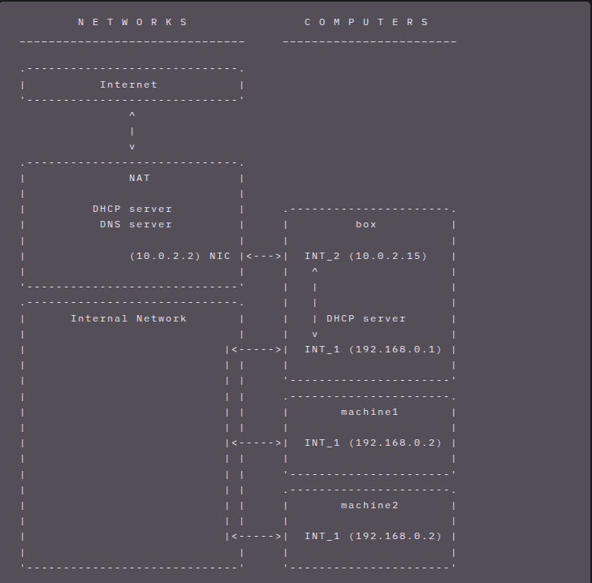

<h1 align="center">Connect</h1>


This project involves configuring network connectivity between three virtual machines (VMs).
We only have access to one machine, ``machine 2``. The latter will connect to the Internet using the ``box`` machine, which will act as a router. The ``box``, for its part, will access the Internet via a network [NAT (Network Address Translation)](https://en.wikipedia.org/wiki/Network_address_translation).
For machines to communicate, they must have an [IP address](https://en.wikipedia.org/wiki/IP_address).
IP addresses can be configured ``statically`` (manually) or obtained ``dynamically`` from a [DHCP server](https://en.wikipedia.org/wiki/Dynamic_Host_Configuration_Protocol).


The following image illustrates the configuration of the machines:    

        


**Use in the project**:
-INT_1: Network between box, machine1, machine2
-INT_2: Network between box and NAT


**Roles**:
-**Box**: Router with NAT, DHCP server, DNS
-**machine1**: Client with static IP
-**machine2**: Client that you configure in DHCP


We start by listing the steps for configuring the VMs, then some commands which allow you to manage conflicts because if you notice in the image we have the IP addresses on the 2VM clients and finally explain some concepts used in this project.

## The configuration steps in the VirtualBox interface     
1. Configure the box by going to Settings->Network
    -Configure the 2 NICs:
*Adapt 1: check Enabale Network, choose ``Internal Network`` and the name: ``intnet(ex)``
      *Adapt 2: check Enabale Network and choose ``NAT``
      *And press ``OK``.
2. Configure the 2 VMs, by going to Settings->Network:
    -Here we just activated Adapter 1, choosing ``Internal Network`` and the same name for the box: ``intnet(ex)``
    -And press ``OK``.

## The commands used
After configuring the machines, you can check the current IP address (``machine 2``) by:
```sh
ip addr show
```     
And if there are conflicts due to identical IP addresses, we change the address of a machine.
You should know that Linux offers several methods for configuring the network.
Here we can change the IP address of two ways:
-Static method: we manually edit the /etc/network/interfaces file:
```sh
nano /etc/network/interfaces
```     
Specifies the IP address:     

``` sh 
    auto enps03(interface name)
    iface enps03 inet static
    address 192.0.2.3 # Here we changed .2 to .3
    gateway 192.168.0.1
    dns-namserver 8.8.8.8 
```         
And we can restart the interface with the following command:
```sh
ifdown enps03 && ifup enps03
```
or restart the VM.
-Dynamic method: Always by editing the /etc/network/interfaces file, but here we do not manually change the address:

```sh
nano /etc/network/interfaces
```     
And modify by:     

```sh 
    auto enps03
    iface enps03 inet dhcp
```

Always check the current address by: ``ip addr show``

## Concepts     

### Internet Protocol (IP) address

An **IP address**is a unique identifier assigned to each device connected to a network.

Here we take the example of **IPv4**but at the level of the important links, we have the explanation and the difference **IPv4**and **IPv6**.
**IPv4 format**: 4 bytes (32 bits) written in dotted decimal notation
-Example: `192.168.0.2`
-Each byte: 0-255

**Types of IP addresses**:

1. **Public Addresses**: Routable on the Internet (ex: `8.8.8.8`)
2. **Private Addresses**: Not routable on the Internet, reserved for local networks
   -Class A: `10.0.0.0` -`10.255.255.255`
   -Class B: `172.16.0.0` -`172.31.255.255`
   -Class C: `192.168.0.0` -`192.168.255.255`

### Subnet Mask

The **subnet mask**defines which part of the IP address identifies the network and which part identifies the host.

**Examples**:
-`255.255.255.0` or `/24`: First 3 bytes = network, last byte = host
-`255.255.0.0` or `/16`: The first 2 bytes = network
-`255.0.0.0` or `/8`: The first byte = network

**In our project**:
-Network: `192.168.0.0/24`
-Available addresses: `192.168.0.1` to `192.168.0.254`
-`192.168.0.0`: Network address
-`192.168.0.255`: Broadcast address

### IP Address Conflict

An **IP conflict**occurs when two devices have the same IP address on the same network.

**Consequences**:
-Significant packet loss
-Unstable connections
-The two machines "fight" to respond to requests
-Unpredictable network behavior

**In our project**: machine1 and machine2 both have `192.168.0.2`

## DHCP (Dynamic Host Configuration Protocol)
**DHCP**is a protocol that automatically assigns network configurations to devices.

**Items assigned by DHCP**:
-IP address
-Subnet mask
-Default gateway (Gateway)
-DNS servers
-Lease duration

### How DHCP Works (DORA Process)

1. **DISCOVER**: The client sends a broadcast “I am looking for a DHCP server”
2. **OFFER**: The DHCP server responds “Here is an available IP”
3. **REQUEST**: The client asks “I want this IP”
4. **ACKNOWLEDGE**: The server confirms “OK, this IP is yours”

### Server vs Client DHCP

**DHCP server**:
-Manages a pool of available IP addresses
-Assigns and tracks distributed addresses
-In our project: the "box" is the DHCP server

**DHCP client**:
-Request network configuration from the server
-Renews your lease periodically
-In our project: machine2 becomes a DHCP client

### Static vs Dynamic IP

**Static IP**:
-Configured manually
-Never change
-Advantages: Predictable, stable for servers
-Disadvantages: Risk of conflicts, manual management

**Dynamic IP (DHCP)**:
-Automatically assigned
-May change when lease expires
-Advantages: No conflicts, automated management
-Disadvantages: Address may change

## NAT (Network Address Translation)

### Principle of NAT
**NAT**translates private IP addresses into public IP addresses to allow access to the Internet. It is the simplest way to access an external network from a virtual machine. Typically, it does not require any configuration on the host network and guest system. This is why it is the default network mode in Oracle VM VirtualBox.

**Why NAT?**:
-Shortage of public IPv4 addresses
-Security: Internal machines are hidden
-Allows multiple devices to share a single public IP

### 3.2 Types of NAT

**1. Static NAT**:
-A private IP = A fixed public IP
-Used for servers accessible from the Internet

**2. Dynamic NAT**:
-Pool of shared public IPs
-Dynamic attribution

**3. PAT (Port Address Translation) /NAT Overload**:
-Multiple private IPs = One public IP
-Uses different port numbers
-**This is what our box uses!**

### 3.3 How NAT works in our Project

```
machine2 (192.168.0.2) → Box → Internet (10.0.2.2) → Internet
```

**Steps**:
1. machine2 sends a packet to `google.com`
2. Source: `192.168.0.2:54321`, Destination: `142.250.x.x:80`
3. The box translates: Source: `10.0.2.2:54321`, Destination: `142.250.x.x:80`
4. Google responds to `10.0.2.2:54321`
5. The box translates and returns to `192.168.0.2:54321`

### NAT table

The box maintains a **NAT table**which maps:
-Private IP: Port → Public IP: Port

Example :
```
192.168.0.2:54321 ↔ 10.0.2.2:54321
192.168.0.3:43210 ↔ 10.0.2.2:43210
```

## Routing and Routing Tables


**Routing**is the process of selecting the path to deliver packets to their destination.

### Default Gateway

The **gateway**is the router that provides access to external networks.

**In our project**:
-Machine2 gateway: `192.168.0.1` (the box)
-All Internet traffic goes through this gateway

### Routing Table

The **routing table**contains the routing rules of a system.

```sh
# Show routing table
ip route show
```

**Example output**:
```
default via 192.168.0.1 dev enps03 # Everything else → gateway
192.168.0.0/24 dev enps03 proto kernel # Local network → directly
```

**Meaning**:
-`default`: Default route (for everything that is not local)
-`via 192.168.0.1`: Go through this gateway
-`dev enps03`: Use this interface
-`192.168.0.0/24`: Local network, direct communication

### Routing in the Project

```
machine2 → ping google.com
↓
Routing table: "Not in 192.168.0.0/24 → use default gateway"
↓
Packet sent to 192.168.0.1 (box)
↓
Box applies NAT and route to Internet
```


## DNS (Domain Name System)

**DNS**translates domain names into IP addresses.

**Example**:
-You type: `google.com`
-Translated DNS: `142.250.185.46`

### DNS hierarchy

```
. (root)
  ↓
.com (TLD -Top Level Domain)
  ↓
google.com (Domain)
  ↓
www.google.com (Subdomain)
```

### 5.3 DNS Servers

**Server types**:
1. **Recursive DNS Server**: Does the searches for you (ex: `8.8.8.8`)
2. **Authoritative DNS Server**: Has official records

**Current Public DNS**:
-Google: `8.8.8.8`, `8.8.4.4`

### DNS configuration under Linux

```sh
# DNS configuration file
cat /etc/resolv.conf

# Example of content :
namemer 192.168.0.1 # DNS of the box
namemer 8.8.8.8 # DNS Google (backup)
`````
### DNS in our Project

``` sh
machine2: ping google.com
↓
1. Consult /etc/resolv.conf → DNS server: 192.168.0.1
↓
2. Ask the box: “What is the IP of google.com?”
↓
3. Box (or upstream DNS) responds: “142.250.185.46”
↓
4. machine2 ping 142.250.185.46
```

## ICMP Protocol and Ping Command

### ICMP protocol

**ICMP**(Internet Control Message Protocol) is a diagnostic and control protocol.

**Uses**:
-Connectivity tests (ping)
-Error messages (destination unreachable)
-Trace routes (traceroute)

** ICMP is not TCP or UDP**: It is a layer 3 (network) protocol

### Ping command

**ping**sends ICMP Echo Requests and waits for Echo Reply.

```sh
# Simple ping
ping google.com

# Ping with packet limit (ic 4 packets)
ping -c 4 google.com

# Ping with timeout
timeout 1m ping google.com
Or
timeout --signal SIGINT 1m ping google.com
```

**Ping output**:
```
64 bytes from google.com (142.250.185.46): icmp_seq=1 ttl=117 time=15.2 ms
```

-`64 bytes`: Packet size      
-`icmp_seq`: Sequence number        
-`ttl`: Time To Live (number of jumps remaining)        
-`time`: Latency (Round Trip Time)        

### Interpretation of Results

**Ping Statistics**:
```
---google.com ping statistics ---
4 packets transmitted, 4 received, 0% packet loss, time 3005ms
rtt min/avg/max/mdev = 14.2/15.1/16.3/0.8 ms
```

-`0% packet loss`: Stable connection      
-`>10% packet loss`: Network problem (IP conflict in our case)      
-`100% packet loss`: No connectivity      

**Response Time (RTT)**:        
-`< 1ms`: Local network     
-`1-30ms`: Very good      
-`30-100ms`: Acceptable     
-`> 100ms`: Slow      
-`> 300ms`: Very slow           
### Packet Loss and IP Conflict

**In our project**:
-**With conflict**: machine1 and machine2 have the same IP
  -When a packet arrives for `192.168.0.2`, who responds?
  -Both machines try to respond
  -Result: packet loss, missing responses
  
-**After resolution**: different IPs
  -Each package arrives at the right machine
  -No confusion
  -Packet loss < 1%


## Network Interfaces
A **network interface**is a connection point between a computer and a network.

**Types**:          
-**Physical**: Ethernet network card (enps03, enp0s3)       
-**Virtual**: Loopback (lo), tunnels, VPN     
-**Wireless**: WiFi (wlan0, wlp2s0)       

### Nomenclature of Interfaces

**Old nomenclature**:          
-`enps03`, `eth1`: Ethernet     
-`wlan0`: WiFi      
-`lo`: Loopback     

**New nomenclature (Systemd)**:     
-`enp0s3`: en=Ethernet, p0=PCI bus 0, s3=slot 3 (our case here)       
-`wlp2s0`: wl=Wireless LAN      
-`eno1`: on-board device index 1      

### Loopback interface

**lo (127.0.0.1)**: Local virtual interface           
-Allows the machine to communicate with itself           
-Always active          
-Used to test local services           


### States of an Interface

```sh
# Output of ip link show:
2: enps03: <BROADCAST,MULTICAST,UP,LOWER_UP> mtu 1500     
```

-`UP`: Interface activated        
-`LOWER_UP`: Cable connected (physical layer OK)      
-`BROADCAST`: Supports broadcast        
-`MULTICAST`: Supports multicast        
-`mtu 1500`: Maximum Transmission Unit (max packet size)        


### Other Configuration Methods

Don't forget Linux offers several methods to configure the network:

1. **ip command**(temporary)      
2. **dhclient**(DHCP)     
3. **/etc/network/interfaces**(Debian/Ubuntu)     

### Temporary Configuration (ip)

```sh
# Assign an IP manually
ip addr add 192.168.0.10/24 dev enps03

# Delete an IP
ip addr del 192.168.0.10/24 dev enps03

# Add a default route
ip route add default via 192.168.0.1

# Enable interface
ip link set enps03 up
```

**Note**: These changes are lost upon restart!


**Restart the network**:
```sh
systemctl restart networking
# Or
/etc/init.d/networking restart
```


### Important Configuration Files

```sh
# DNS configuration
/etc/resolv.conf

# Network configuration (Debian style)
/etc/network/interfaces

# Netplan configuration
/etc/netplan/*.yaml

#Hostname
/etc/hostname
/etc/hosts

# DHCP leases
/var/lib/dhcp/dhclient.leases

# Network logs
/var/log/syslog
journalctl -u networking
```

## OSI and TCP/IP model

### OSI model (7 layers)

The **OSI model**describes how data flows in a network:

| Layer | Name | Role | Examples |
|--------|---------|------|---------|
| 7 | Application | User interface | HTTP, FTP, SSH, DNS |
| 6 | Presentation | Data format | SSL/TLS, JPEG, ASCII |
| 5 | Session | Session management | NetBIOS, RPC |
| 4 | Transportation | Reliable transmission | TCP, UDP |
| 3 | Network | Routing | IP, ICMP, NAT |
| 2 | Binding | Physical addressing | Ethernet, MAC, Switch |
| 1 | Physics | Electrical signal | Cables, WiFi, Bits |

### TCP/IP model (4 layers)

Practical model used on the Internet:

| TCP/IP layer | OSI equivalent | Protocols |
|---------------|----------------|------------|
| Application | 5, 6, 7 | HTTP, DNS, SSH, FTP |
| Transportation | 4 | TCP, UDP |
| Internet | 3 | IP, ICMP, NAT |
| Network access | 1, 2 | Ethernet, WiFi |

### 9.3 Encapsulation des Données

Quand vous envoyez des données, chaque couche ajoute son en-tête :

```
[Données]
↓ Couche 4
[TCP Header][Données]
↓ Couche 3
[IP Header][TCP Header][Données]
↓ Couche 2
[Ethernet Header][IP Header][TCP Header][Données][Ethernet Trailer]
```

**Exemple avec notre ping** :
```
Application : "ping google.com"
↓
ICMP : Echo Request
↓
IP : Source=192.168.0.2, Dest=142.250.185.46
↓
Ethernet : MAC source → MAC destination
```
### 9.4 Protocols per Layer in our Project

**Layer 7 (Application)**:
-DNS: Resolution of "google.com"

**Layer 4 (Transport)**:
-Not used directly (ICMP is layer 3)

**Layer 3 (Network)**:
-IP: Addressing 192.168.0.2 → 142.250.x.x
-ICMP: Ping protocol
-NAT: Address translation

**Layer 2 (Link)**:
-Ethernet: Communication on the local network
-ARP: MAC resolution of 192.168.0.1

**Layer 1 (Physical)**:
-Virtual in VirtualBox
## 10. VirtualBox and Network Virtualization

### 10.1 VirtualBox Network Modes

**1. NAT (Network Address Translation)**:
-VM can access the Internet
-VM invisible from the outside
-Each VM has its own NAT network (10.0.2.0/24)
-VM IP: generally 10.0.2.15
-Gateway: 10.0.2.2

**Use in the project**:
-NIC interface of the box → Internet access

**2. Internal Network**:
-VMs can communicate with each other
-Isolated from the host and the Internet
-Requires a router/gateway to access the Internet
-Network name: `intnet1`, `intnet2`, etc.


## Network Diagnostics and Troubleshooting

### Diagnostic Commands

**Test connectivity**:
```sh
# Local ping
ping 127.0.0.1 # Test TCP/IP stack

# Ping gateway
ping 192.168.0.1 # Test local network

# Ping DNS
ping 8.8.8.8 # Test Internet (without DNS)

# Ping domain name
ping google.com # Test DNS + Internet
```


### Common Problems and Solutions
**No IP address**:
```sh
# Check DHCP status
journalctl -u dhclient

# Renew the lease
dhclient -r enps03 && dhclient enps03

# Check if interface UP
ip link set enps03 up
```

**No gateway**:
```sh
# Add default route
ip route add default via 192.168.0.1

# Check routing table
ip route show
```

**DNS not working**:
```sh
# Check /etc/resolv.conf
cat /etc/resolv.conf

# Add DNS manually
echo "nameserver 8.8.8.8" >> /etc/resolv.conf
```
## Some important links

[Network Configuration](https://wiki.debian.org/NetworkConfiguration#Using_DHCP_to_automatically_configure_the_interface)     
[IPv4 vs IPv6](https://www.geeksforgeeks.org/computer-networks/differences-between-ipv4-and-ipv6/)           
[NIC (Network Interface Card)](https://www.geeksforgeeks.org/computer-networks/nic-full-form/)        
[LAN (Local area network)](https://www.geeksforgeeks.org/computer-networks/lan-full-form/)           
[Computer Network](https://www.geeksforgeeks.org/computer-networks/basics-computer-networking/)     
[Virtual Networking from manual of Oracle VM VirtualBox](https://docs.oracle.com/en/virtualization/virtualbox/6.0/user/networkingdetails.html)
